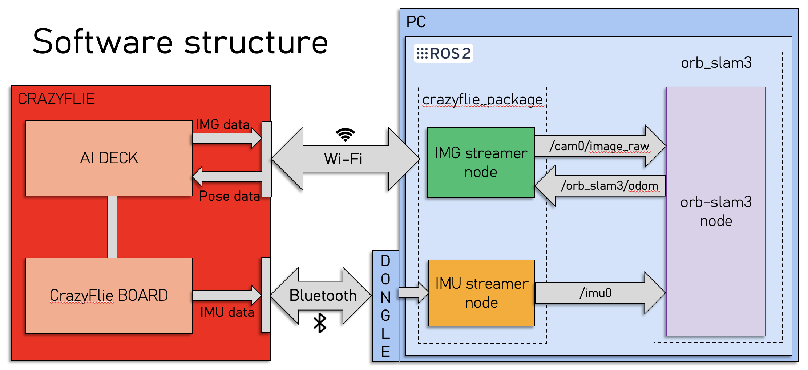
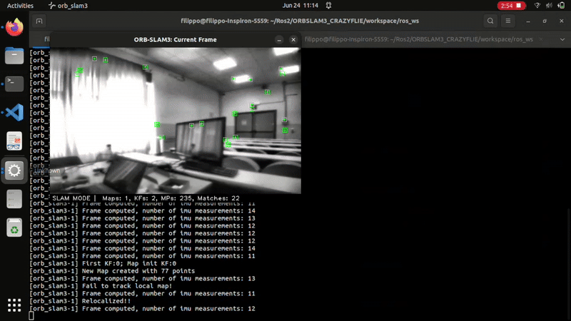

# ORBSLAM3_CRAZYFLIE

ORBSLAM3_CRAZYFLIE is a project that integrates the ORB-SLAM3 Visual-Inertial Odometry system with the Crazyflie nano quadcopter platform. This enables real-time localization for autonomous navigation and research applications.

## Features

- Real-time Visual-Inertial Odometry using ORB-SLAM3
- ROS2 (Robot Operating System 2) compatibility

## Requirements

- Crazyflie 2.x quadcopter
- AI deck
- [ORB-SLAM3](https://github.com/UZ-SLAMLab/ORB_SLAM3)
- ROS2 Humble
- Python 3.x
- C++17 compatible compiler

## Project Structure

 ```
ORBSLAM3_CRAZYFLIE/
├── Pangolin/ # Custom build of Pangolin library
├── ORB_SLAM3/ # ORB-SLAM3 source code
└── ros_ws/ # ROS2 workspace
  └── src/
    ├── crazyflie_package/ # Nodes for streaming from Crazyflie
    └── orb_slam3/ # ORB-SLAM3 ROS2 integration
         └── config/ # Calibration files (e.g., camera_and_slam_settings.yaml)
 ```


## Installation

1. Clone this repository:
    ```bash
    cd ~
    git clone --recursive https://github.com/FiloSamo/ORBSLAM3_CRAZYFLIE.git
    ```
2. Build the custom Pangolin library from the provided source code:
    ```bash
    cd ORBSLAM3_CRAZYFLIE/Pangolin
    source install_prerequisites.sh
    mkdir build
    cd build
    cmake .. && make
    make install
    ```

3. Add an environment variable with the path to the Pangolin library (it is recommended to add this command to your `.bashrc` file in your home directory):
    ```bash
    export Pangolin_DIR="~/ORBSLAM3_CRAZYFLIE/Pangolin/build:$Pangolin_DIR"
    ```

4. Install ORB-SLAM3 and its dependencies (see the [ORB-SLAM3 installation guide](https://github.com/UZ-SLAMLab/ORB_SLAM3)).

5. Update your `.bashrc` file with the environment variable for the ORB-SLAM3 library path:
    ```bash
    export LD_LIBRARY_PATH="~/ORBSLAM3_CRAZYFLIE/ORB_SLAM3/lib:/usr/local/lib:$LD_LIBRARY_PATH"
    ```

6. In the `~/ORBSLAM3_CRAZYFLIE/ros_ws/src/orb_slam3` package, update the `CMakeLists.txt` file with the correct paths to your libraries:
    ```cmake
    set(ORB_SLAM3_DIR "~/ORBSLAM3_CRAZYFLIE/ORB_SLAM3")  # Adjust this to your ORB_SLAM3 directory

    set(PANGOLIN_LIB_DIR "~/ORBSLAM3_CRAZYFLIE/Pangolin/build/src/libpangolin.so")  # Adjust this to your Pangolin library path
    ```

7. In the `~/ORBSLAM3_CRAZYFLIE/ros_ws/src/orb_slam3` package, add the `ORBvoc.txt` file to the `config` folder. You can find this file in the `ORB_SLAM3/Vocabulary` folder.

8. Install the dependencies required to run the project:
    ```bash
    cd ~/ORBSLAM3_CRAZYFLIE/ros_ws
    rosdep install --from-paths src
    ```
9. Build the ROS2 workspace:
    ```bash
    colcon build
    ```

## Drone setup

To perform Visual-Inertial Odometry with the Crazyflie, you must set up the hardware correctly. Follow the guide provided by Bitcraze to set up the drone and the AI deck firmware: https://www.bitcraze.io/documentation/tutorials/getting-started-with-aideck/

We have implemented a custom AI-deck application for this project. To use it, first download the AI-deck examples folder from: https://github.com/bitcraze/aideck-gap8-examples. Replace the `examples/other/wifi-img-streamer` folder with our implementation. Then, follow the commands suggested in the AI deck guide:

1. Build the application:
    ```bash
    sudo docker run --rm -v ${PWD}:/module --privileged bitcraze/aideck tools/build/make-example examples/other/wifi-img-streamer clean all
    ```
2. Upload to the Crazyflie:
    ```bash
    cfloader flash examples/other/wifi-img-streamer/BUILD/GAP8_V2/GCC_RISCV_FREERTOS/target.board.devices.flash.img deck-bcAI:gap8-fw -w [CRAZYFLIE_URI]
    ```

After setting up the drone, you **must** perform a calibration to obtain the intrinsic parameters of the camera and the IMU, as well as the homogeneous transformation between the camera frame and the IMU frame. Then, update the parameters inside the ORBSLAM3_CRAZYFLIE project.

The parameters used by orb_slam3 are in the `camera_and_slam_settings.yaml` file inside the `config` folder of the orb_slam3 ROS2 package (`~/ORBSLAM3_CRAZYFLIE/ros_ws/src/orb_slam3/config/camera_and_slam_settings.yaml`). 

**Note:** When this project was implemented, the latest firmware release (2025.02) did not work properly (the image stream was blocked after some time), so release 2024.2 was used.

## Usage

After completing the installation, you can perform real-time VIO with the Crazyflie by following these steps:

1. Source the ROS2 environment:
    ```bash
    cd ~/ORBSLAM3_CRAZYFLIE/ros_ws
    source install/local_setup.bash
    ``` 
2. Connect to the "WiFi streaming example".
   
3. Launch the streamers for the images and IMU data (with the correct URI):
    ```bash
    ros2 launch crazyflie_package streaming.launch.py URI:=radio://0/86/2M/E7E7E7E7E7
    ```  
    
4. Launch the VIO:
    ```bash
    ros2 launch orb_slam3 monocular_vio.launch.py
    ```  

### Optional

You can pass optional parameters to the launch file:

- `URI`: Radio address of the Crazyflie.
- `IP`: IP address for WiFi communication.
- `PORT`: Port number for WiFi communication.
- `LOG_ACTIVE`: Set to `True` to enable logging of the Crazyflie console output to a text file.

When `LOG_ACTIVE` is enabled, a file named `console_crazyflie.txt` will be created in the directory where you run the command.

Example usage:
```bash
ros2 launch crazyflie_package streaming.launch.py URI:=radio://0/86/2M/E7E7E7E7ED IP:=192.168.4.1 PORT:=5000 LOG_ACTIVE:=False
```
The default values are those shown in the example command.

## Demo



In this demo, we show the algorithm operating in a rectangular room. You can observe the algorithm restoring the correct position after losing feature tracking. Additionally, the algorithm is able to close the loop when the drone returns to the starting position, compensating for drift error.

## Calibration (suggested procedure)

To use VIO, you need to provide the correct intrinsic parameters for the camera and the IMU. In addition, you need to provide the homogeneous transformation between the camera and the IMU. 

You can perform the calibration as you prefer; in our case, we used the well-established Kalibr tool https://github.com/ethz-asl/kalibr. To use the Kalibr calibration package, ROS1 Melodic is necessary. We used a Docker container with ROS1 Melodic to run the code.

#### Camera calibration

First, create a rosbag recording the `/cam0/image_raw` and `/imu0` topics. As mentioned in the Kalibr guide, you need to capture a video of a calibration pattern (e.g., aprilgrid) while moving the drone to excite the IMU along all axes.

Then, convert the rosbag from ROS2 format to ROS1 format. You can use the rosbags utils:

```bash
pip install rosbags
rosbags-convert --src [ROS2 BAG FOLDER PATH] --dst [ROS1 BAG FILE (.bag)]
```

After recording, run the Kalibr node to obtain the extrinsic parameters of the camera:

1. Write a `param.yaml` file with the information related to the camera and the calibration target:

    ```yaml
    target_type: 'aprilgrid'
    tagCols: 3
    tagRows: 4
    tagSize: 0.05
    tagSpacing: 0.2
    ```

2. Run the Kalibr camera calibration script:
    ```bash
    rosrun kalibr kalibr_calibrate_cameras --target ./param.yaml --bag ./calibration_bag.bag --models pinhole-radtan --topics /cam0/image_raw
    ```

3. The parameters will be inserted by the script in the `calibration_bag-camchain.yaml` file.

#### IMU noise density and random walk estimation

The IMU noise density and random walk are necessary to perform a joint optimization between the recorded camera motion and the IMU data to obtain the homogeneous transformation between the two.

To estimate the noise density and random walk, you can use the ROS1 package `allan_variance_ros`: https://github.com/ori-drs/allan_variance_ros. Record a rosbag (the longer, the better; 3 hours is suggested) for the `/imu0` topic with the drone stationary. After recording, run the following commands:

1. Reorganize the messages by timestamps.
    ```bash
    rosrun allan_variance_ros cookbag.py --input original_rosbag --output cooked_rosbag.bag
    ```

2. Create a folder to store the rosbag.
    ```bash
    mkdir bag_folder
    mv cooked_rosbag.bag ./bag_folder
    ```
3. Create a config file `config.yaml`:

    ```yaml
    imu_topic: "/imu0"
    imu_rate: 100
    measure_rate: 100 # Rate to which IMU data is subsampled
    sequence_time: 10800
    ```

4. Run the command for parameter estimation:

    ```bash
    rosrun allan_variance_ros allan_variance ./bag_folder ./config.yaml
    ```

5. The next step is to visualize the plots and get parameters estimation:

    ```bash
    rosrun allan_variance_ros analysis.py --data ./bag_folder/allan_variance.csv
    ```

An `imu.yaml` file will be created with the estimated parameters.

#### Joint Camera and IMU calibration

After `camchain.yaml` and `imu.yaml` are ready, use the previously recorded rosbag to obtain the homogeneous transformation.

```bash
rosrun kalibr kalibr_calibrate_imu_camera --bag ./calibration_bag.bag --cam ./camchain.yaml --imu ./imu.yaml --target ./param.yaml
```
The result is written inside the `calibration_bag-camchain-imucam.yaml` file.

**Note:** It may be necessary to trim the `calibration_bag.bag` because Kalibr can have issues at the beginning and end of the rosbag. To do this, use the following command to remove some data from the start and end of the rosbag.

To check the start and end times of `calibration_bag.bag`, run:

```bash
rosbag info calibration_bag.bag 
```

Then run the rosbag filter command, adding some seconds to the start time and removing some seconds from the end time.

```bash
rosbag filter calibration_bag.bag trimmed_calibration_bag.bag "t.to_sec() > [new start time] and t.to_sec() < [new end time]"
```

After calibration, update the parameters inside the ORBSLAM3_CRAZYFLIE project.
The parameters used by ORB-SLAM3 are in the `camera_and_slam_settings.yaml` file inside the `config` folder of the orb_slam3 ROS2 package (`~/ORBSLAM3_CRAZYFLIE/ros_ws/src/orb_slam3/config/camera_and_slam_settings.yaml`). 

## Contributions

The project was mainly developed as a group effort during shared work sessions.
The code was always reviewed collaboratively and checked by all group members, while the main individual contributions were:

* **Daniele Crivellari**: Implementation of image acquisition. Preparation of the PowerPoint presentation.

* **Filippo Ugolini**: Implementation of IMU data acquisition. Preparation of the PowerPoint presentation.

* **Filippo Samorì**: Integration of ROS2 and ORB-SLAM3. Development of the application on the AI-deck. Writing of the README.


## License

This project is licensed under the GPLv3 License.

## Citation

- Campos, C., Elvira, R., Gómez, J. J., Montiel, J. M. M., & Tardós, J. D. (2021). [ORB-SLAM3: An Accurate Open-Source Library for Visual, Visual-Inertial and Multi-Map SLAM](https://ieeexplore.ieee.org/document/9584257). *IEEE Transactions on Robotics*, 37(6), 1874-1890.

- Consiglio, A. (2024, September 10). [Integrating ORB-SLAM3 with ROS2 Humble on Raspberry Pi 5: A Step-by-Step Guide](https://medium.com/@antonioconsiglio/integrating-orb-slam3-with-ros2-humble-on-raspberry-pi-5-a-step-by-step-guide-78e7b911c361). *Medium*.

- Furgale, P., Rehder, J., & Siegwart, R. (2013). [Unified Temporal and Spatial Calibration for Multi-Sensor Systems](https://github.com/ethz-asl/kalibr). *Kalibr: A Toolbox for Camera-IMU Calibration*, ETH Zurich Autonomous Systems Lab.

- Buchanan, R. (2021). [Allan Variance ROS (Version 1.2)](https://github.com/ori-drs/allan_variance_ros). Oxford Robotics Institute, DRS Lab.

- Lovegrove, S. (2019). [Pangolin: A Lightweight Portable Rapid Development Library for Managing OpenGL Display and Interaction](https://github.com/stevenlovegrove/Pangolin).
